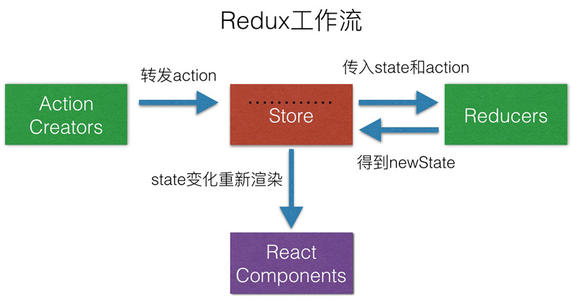

# REDUX 

### 学习文档
1. 英文: https://redux.js.org/
2. 中文: https://cn.redux.js.org/
3. Github: https://github.com/reactjs/redux

一、定义: redux是一个独立的专门用来作状态管理的js库(非react插件)
可以用于react,angular,vue等项目中 与react配合使用 
集中管理react应用中多个组件之间的共享状态 



二、使用redux场景
组件的状态需要共享 
任何地方都可以拿到状态 
一个组件去改变全局状态 
一个组件改变另一个组件的状态  
注意: 能不用则不用 实在不行才用


三、redux核心API 

1. createStore()  
作用: 创建包含指定reducer的store对象 

```
    import { createStore } from 'react'
    import reducer from './reducer'
    const store = createStore(reducer)
```

2. store对象
redux库最核心的管理对象 
内部维护state和reducer  

核心方法:
```
getState()
dispatch(action) 
subscribe(listener) 
```

用法:
```
store.getState() 
store.dispatch({type: 'XXX', arg})
store.subscribe(render)
```

3. 中间件
applyMiddleware()  
应用基于redux的中间件(插件库)

```
import {createStore, applyMiddleware} from 'redux' import thunk from 'redux-thunk' // redux 异步中间件 
const store = createStore(
counter,
applyMiddleware(thunk) // 应用异步中间件 )

```

4. 合并多个reducer
combineReducers()

```
export default combineReducers({ user1,
user2,

```

## redux的核心概念

1. action  

标识要执行行为的对象

包含 2 个属性
(1) type: 标识属性, 值为字符串, 唯一, 必要属性
(2) xxx: 数据属性, 值类型任意, 可选属性

example: 

```
const action = {
type: 'ADD',
data: 1 }
```

创建Action使用的工厂函数 (Action Creater)

```
const increment = (number) => ({type: 'INCREMENT', data: number})
```

2. reducer 

根据旧的state和action  生成新的state的纯函数 

```
export default function counter(state = 0, action) { 
    switch (action.type) {
        case 'INCREMENT':
        return state + action.data
        case 'DECREMENT':
        return state - action.data
        default: return state
    } 
}
// 这里注意是返回一个新的状态  并且不要修改原来的状态 
```

3. store  
将state、action与reducer关联在一起 

获取这个store对象?
```
import {createStore} from 'redux' 
import reducer from './reducer' 
const store = createStore(reducer)

```
这个store对象的功能
getState(): 得到 state
dispatch(action): 分发 action, 触发 reducer 调用, 产生新的 state 
subscribe(listener): 注册监听, 当产生了新的 state 时, 自动调用

 


